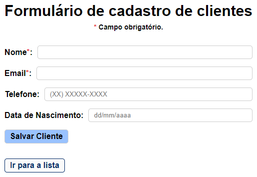
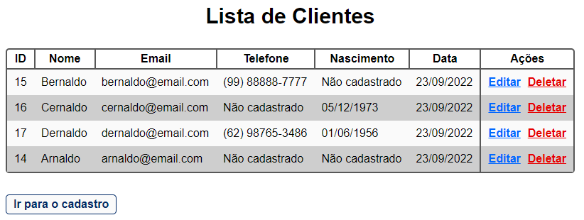

# crud_clientes
<h1>CRUD de cadastro de clientes</h1>

<ol>Principais funcionalidades:  
<li>Cadastro de clientes em banco de dados com validação do formulário (CREATE)</li>
<li>Exibição dos clientes cadastrados (READ)</li>
<li>Edição de clientes cadastrados (UPDATE)</li>
<li>Exclusão de cliente cadastrado (DELETE)</li>
<li>Navegação entre as páginas</li>
<li>Formatação de data e telefone</li>
</ol>

<h2>Página de cadastro</h2>

<h2>Página de exibição</h2>

<h2>Página de edição</h2>

<h2>Página de exclusão</h2>

